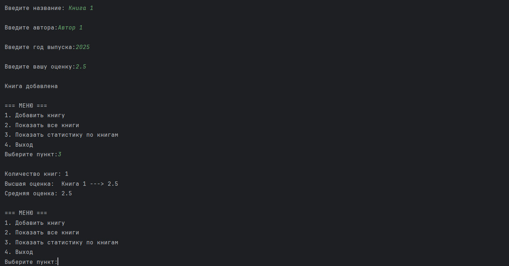

# Лабораторная работа 1 "Трекер книг" 

Выполнил: Ручкин Иван СКБ251

Простая консольная программа написанная на языке C++ для учета прочитанных книг.

Задание: [Пара 1. Трекер книг.pdf](%D0%9F%D0%B0%D1%80%D0%B0%201.%20%D0%A2%D1%80%D0%B5%D0%BA%D0%B5%D1%80%20%D0%BA%D0%BD%D0%B8%D0%B3.pdf)
### 1. Реализованный функционал

###### Добавление информации о книге 
###### Сохранение данные в файл books.txt. 
###### Загрузка данные из файла при запуске 
###### Вывод списка всех книг
###### Вывод статистики

### 2. Описание функций

`main()` - главная функция приложения

`saveBookToFile()` - сохранение книги в файл

`loadBooks()` - загрузка книг из файла 

`Validation()` - валидация входных данных

`input_book()` - получение данных от пользователя

`return_books()` - вывод всех книг

`Menu()` - вывод меню

`stat_books()` - вывод и подсчёт статистики

### 3. Пример использования

