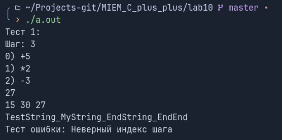

# Лабораторная работа 10 "Шаблонный класс MyPipeline"

Выполнил: Ручкин Иван СКБ251

Цель:
Реализовать шаблонный класс MyPipeline<T> - конвейер обработки данных типа T.
Конвейер состоит из шагов. Каждый шаг преобразует значение по правилу T -> T.

### 1. Реализованный функционал

###### Реализованна шаблонный класс MyPipeline<T> и структура шага 
###### Реализованы методы для работы с шагами пайплайна:
- `addStep` - добавляем шаг
- `removeStep` - убираем шаг
- `run` - запуск пайплайна
- `trace` - дебаг каждого шага
###### Ввполнены тесты 

### 2. Описание функций и классов

`MyPipeline<T>` - шаблонный класс содержащий методы для работы с пайплайном

`main()` - главная функция для тестов

### 3. Пример использования

