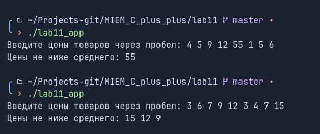

# Лабораторная работа 11 "Практическое применение контейнеров и итераторов"

Выполнил: Ручкин Иван СКБ251

Цель:
Разработать программу, которая запрашивает у
пользователя список цен товаров в виде целых чисел, сортирует их в порядке
убывания, а затем удаляет все цены ниже средней. Используйте итераторы для
доступа и модификации списка.

### 1. Реализованный функционал

###### Использования контейнера vector и итератора для прохода по нему
###### Реализованы функционал для работы с пользовательским вводо:
- получение списка цен от пользователя
- сортировка цен
- нахождение среднего
- вывод результатов

### 2. Описание функций и классов

`main()` - главная функция для тестов

### 3. Пример использования

