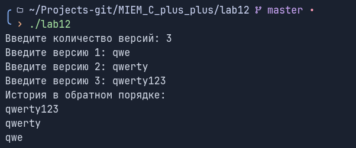

# Лабораторная работа 12 "Разработка и тестирование пользовательских итераторов"

Выполнил: Ручкин Иван СКБ251

Цель:
Разработать программу, которая хранит историю версий документа и позволяет
перебирать версии в обратном хронологическом порядке с помощью
пользовательского обратного итератора.

### 1. Реализованный функционал

###### Реализован класс `DocumentHistory` для хранения истории версий
###### Реализован пользовательский обратный итератор:
- обход версий с конца к началу
- поддержка `operator*`
- поддержка `operator++`
- поддержка `operator!=`

### 2. Описание функций и классов

`DocumentHistory` - класс для хранения версий документа

`ReverseIterator` - пользовательский обратный итератор для обхода истории

`main()` - главная функция для тестов

### 3. Пример использования

