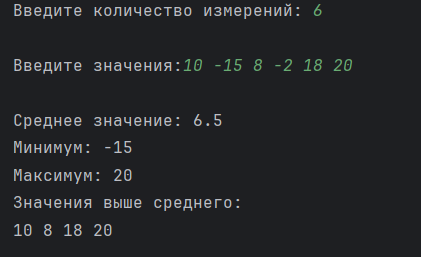

# Лабораторная работа 2-3 "(Одномерные динамические массивы и указатели)" 

Выполнил: Ручкин Иван СКБ251

Простая консольная программа для анализа климатических данных полученных за один день.

Цель:
Написать консольную программу, которая:
- считывает все значения в динамический массив.
- анализирует данные (среднее, минимум, максимум, выбросы).
- создаёт новый динамический массив, содержащий только значения, превышающие среднее.

### 1. Реализованный функционал

###### Ввод количества измерений
###### Ввод всех n значений 
###### Вывод: Среднее, минимум, максимум. Значения, превышающие среднее, в отдельном массиве.

### 2. Описание функций

`main()` - главная функция приложения

`inputData(float* p, int n)` - добавление значений в массив

`average(const float* p, int n)` - среднее значение

`minValue(const float* p, int n)` - минимальное значение

`maxValue(const float* p, int n)` - максимальное значение

`filterAboveAverage(float* p, int n, int& newCount)` - создание массива со значенями выше среднего

### 3. Пример использования

