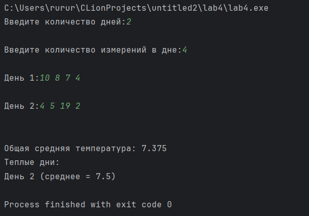

# Лабораторная работа 4 "(Многомерные массивы, указатели и функции)"

Выполнил: Ручкин Иван СКБ251

Простая консольная программа для анализа климатических данных полученных за несколько дней.

Цель:
Написать консольную программу, которая:
- запрашивает количество дней.
- считывает значения температуры с клавиатуры.
- сохраняет данные за каждый день в двумерном динамическом массиве.
- анализирует данные (среднее, минимум, максимум, "Теплые" дни).

### 1. Реализованный функционал

###### Ввод количества дней
###### Ввод количества измерений в день
###### Ввод всех n значений температуры
###### Вывод: Среднее, минимум, максимум. Значения, превышающие среднее, в отдельном массиве.

### 2. Описание функций

`main()` - главная функция приложения

`inputData(float** p, int d, int h)` - добавление значений в массив

`dayAverage(float* row, int h)` - подсчёт среднего значения за день

`overallAverage(float** p, int d, int h)` - подсчет среднего за все дни

`showHotDays(float** p, int d, int h)` - нахождение и вывод "теплых" дней

### 3. Пример использования

