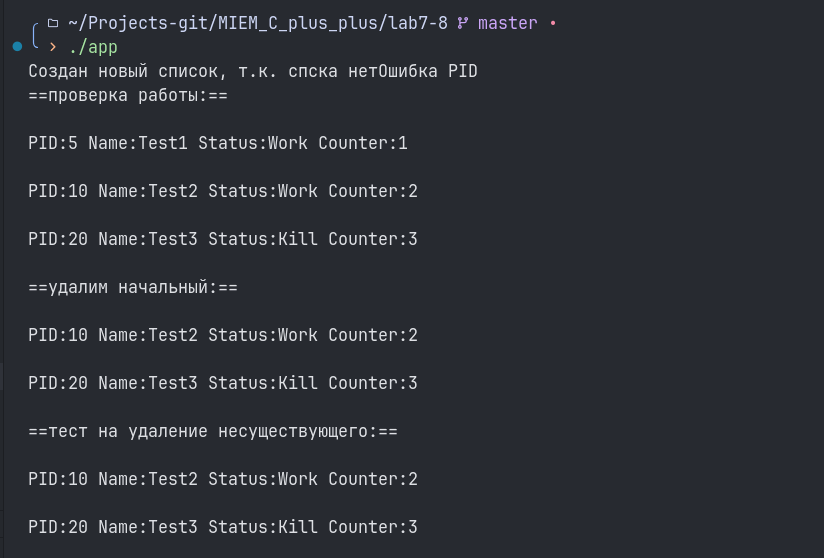

# Лабораторная работа 7-8 "реализация класса на языке C++ для управления связанным списком блоков управления процессами (PCB)"

Выполнил: Ручкин Иван СКБ251

##### Требования (C++17, CMake 3.10+)

### Сборка

``` bash
git clone https://github.com/kernel-paniccc/MIEM_C_plus_plus.git

cd MIEM_C_PLUS_PLUS/lab7-8

cmake .
make

./app
```

### 1. Реализованный функционал

###### Реализованны классы для процесса, узла списка и списка прочессов
###### Реализован весь функционал (insert, remove, printList)
###### Реализованы тесты и обработка ошибок


### 2. Пример использования

