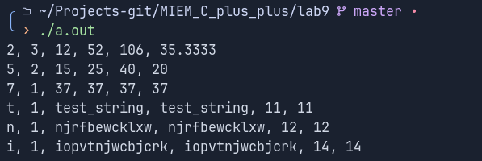

# Лабораторная работа 9 "Шаблонные функции"

Выполнил: Ручкин Иван СКБ251

Цель:
Реализовать шаблонную функцию: groupStats(arr, n, keyFunc, valueFunc)
которая обрабатывает массив arr размера n и возвращает набор групп.
Группы определяются значением ключа keyFunc(x) для каждого элемента x.

### 1. Реализованный функционал

###### Реализованна шаблонная функция для обработки групп
###### Подсчет всех значений:
- key - ключ группы
- count - количество элементов в группе
- minElem - минимальный элемент группы (по оператору <)
- maxElem - максимальный элемент группы (по оператору <)
- sum - сумма значений valueFunc(x) по всем элементам группы
- avg - среднее значение valueFunc(x) по группе
###### Ввполнены тесты 

### 2. Описание функций

`main()` - главная функция для тестов

`struct GroupInfo` - структура для хранение данных по группе

`template<class T, class KeyFunc, class ValueFunc>` - основная шаблонная функция 
(определение типов, создание группы, создание вектора групп)

### 3. Пример использования

